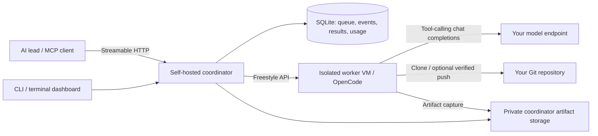

# SwarmForge

**SwarmForge is a self-hosted orchestrator for parallel AI coding agents running in isolated remote VMs.** Your AI lead assigns tasks through the Model Context Protocol (MCP); SwarmForge runs OpenCode workers in Freestyle VMs, tracks their progress, and preserves their results and files.

[Website](https://getswarmforge.tech) · [Setup guide](https://getswarmforge.tech/docs/) · [Releases](https://github.com/GavinGeizer/swarmforge-oss/releases) · [Developer onboarding](CONTRIBUTING.md)

The coordinator runs on your Linux machine. Each worker gets a separate VM, workspace, and OpenCode session. You supply the VM snapshot, model endpoint, and Git repository. The CLI provides initialization, readiness checks, a terminal dashboard, and artifact retrieval. SwarmForge is [source-available under PolyForm Small Business 1.0.0](#license), which restricts permitted business use.

## Why distribute coding workers?

A single-machine coding-agent manager runs agent processes against the resources and workspaces of one host. SwarmForge separates the coordinator from worker compute:

- **Separate execution environments:** each worker runs in its own Freestyle VM with tools from your prepared snapshot. Worker compute runs remotely; the coordinator owns scheduling and state.
- **Durable coordination:** SQLite stores the queue, follow-up dispatches, structured results, events, and observed usage. Restart reconciliation reconnects retained VMs and sessions; uncertain task delivery requires inspection before replay.
- **Deliverables that survive cleanup:** declared files, logs, and standard artifact directories are copied into private coordinator storage and checked with SHA-256 before normal VM destruction.
- **Explicit source handoff:** optional GitHub App, GitHub OAuth, or SSH modes push worker branches and verify the remote commit. Your lead reviews the evidence and integrates changes.

This suits independent implementation, review, research, and documentation tasks. The lead decomposes work and coordinates dependencies through Git and follow-up messages. SwarmForge does not automatically plan dependencies, merge branches, or open pull requests.

## Contents

- [Before you start](#before-you-start)
- [Quick start](#quick-start)
- [Architecture and workflow](#architecture-and-workflow)
- [Supported harnesses, models, and infrastructure](#supported-harnesses-models-and-infrastructure)
- [Download, build, and install](#download-build-and-install)
- [Initialize a deployment](#initialize-a-deployment)
- [Check setup and start the server](#check-setup-and-start-the-server)
- [Connect an MCP client](#connect-an-mcp-client)
- [Run a first task and collect the result](#run-a-first-task-and-collect-the-result)
- [Dashboard search and filters](#search-filter-and-sort-the-dashboard)
- [Retained VMs and cleanup](#review-retained-vms-and-clean-up)
- [Troubleshooting](#troubleshooting)
- [Build and packaged installation](#build-and-packaged-installation)
- [Developer onboarding](CONTRIBUTING.md)
- [Documentation](#documentation)
- [License](#license)

## Before you start

The supported host is **Linux x64 with glibc**. The public installer requires a normal user account, Bash, curl, GNU tar, and coreutils; it refuses root execution. Building from a checkout requires Git and **Bun 1.4.2 or newer** (CI and release builds pin 1.4.2). The installed executable includes its runtime and does not require Bun or `node_modules`.

Have these infrastructure details ready before initialization:

| Required value | What to provide |
| --- | --- |
| `FREESTYLE_API_TOKEN` | A Freestyle account API token used to manage worker VMs. |
| `FREESTYLE_SNAPSHOT_ID` | An existing snapshot ID or slug, prepared with the worker tools below. |
| `SWARMFORGE_MODEL_BASE_URL` | An OpenAI-compatible chat-completions API base URL, usually ending in `/v1`, reachable from the VMs. |
| `SWARMFORGE_MODEL_API_KEY` | A worker-scoped inference key. For an unauthenticated endpoint, use a nonempty placeholder. |
| `SWARMFORGE_MODEL_NAME` | The exact model ID accepted by the endpoint. The model must support tool calls. |
| `SWARMFORGE_GIT_TREE` | A cloneable Git URL or path available to the worker. Use `none` or `none:/prepared/path` to use a prepared workspace instead of cloning. |

The **worker snapshot** must contain OpenCode compatible with SDK 1.18.31, Python 3, Git, Bash, running systemd, and the tools needed for your tasks. OpenCode must be on the service PATH and the guest workspace must be writable. See the [worker snapshot checklist](docs/WORKER-SNAPSHOT.md) before creating your snapshot. Repository access can be connected through GitHub OAuth during initialization or configured through GitHub App or SSH credentials. Mounts and networking are prepared externally. These guest prerequisites are separate from the control-plane host.

Installing and initializing create no worker VMs. Spawning a worker provisions a billable VM; completed workers retain their VMs until explicitly destroyed.

## Quick start

### Install the published executable

After gathering the six required settings above, run this in Bash on the supported host. This pins the published **v0.1.2** release:

```sh
mkdir -p ~/my-swarmforge
cd ~/my-swarmforge
curl -fsSL https://getswarmforge.tech/install -o install-swarmforge.sh
bash install-swarmforge.sh --version 0.1.2 --install-only --no-modify-path
export PATH="$HOME/.local/bin:$PATH"
swarmforge --version
swarmforge init --config "$PWD/config.toml"
swarmforge doctor --config ./config.toml
swarmforge serve --config ./config.toml
```

You can [inspect the installer](https://getswarmforge.tech/install) before executing it. It downloads versioned GitHub assets, verifies both archive and executable checksums, and installs at `~/.local/bin/swarmforge`. These flags keep installation separate from initialization and leave shell profiles unchanged. `--version` should print `0.1.2`. To persist PATH, follow [these shell instructions](#make-the-command-available-in-your-terminal-and-workspace).

`init` asks for your real infrastructure settings and creates a private `.env` plus `config.toml` here. Keep passing this `--config` to select the deployment independently of global configuration. Exported SwarmForge/provider environment variables still take precedence; inspect `swarmforge config show --config ./config.toml` if settings differ from what you entered. If `.env` already exists, skip `init` and follow [the existing-environment instructions](#if-you-already-have-an-environment-file).

Keep `serve` running. In another terminal, from the same deployment directory:

```sh
export PATH="$HOME/.local/bin:$PATH"
swarmforge status --config ./config.toml
```

Connect your MCP client to `http://127.0.0.1:8787/mcp` using the [configuration below](#connect-an-mcp-client), then [run the first task](#run-a-first-task-and-collect-the-result). Installation and ordinary `doctor` checks create no VMs. A complete remote task needs your prepared snapshot, working model, and repository access.

The installer, release executable, fresh source build, and local initialization path were [verified on Linux x64 with glibc](docs/README-AUDIT.md#verification). This verification does not certify your providers or snapshot. Optionally run `swarmforge doctor --config ./config.toml --live` to check snapshot access and a small model tool call; inference charges may apply. It creates no VM. See [live-check limits](docs/OPERATOR-WORKFLOWS.md#explicit-live-readiness-checks).

### Build from source

Use the [source installation steps](#download-build-and-install) below, or [CONTRIBUTING.md](CONTRIBUTING.md) to develop and test without provider credentials.

## Architecture and workflow



1. **Assign:** your lead calls `spawn_worker` with a bounded task and expected deliverables. The coordinator queues it, provisions a VM from your snapshot, prepares the repository, and starts OpenCode.
2. **Observe and follow up:** inspect progress through MCP or `swarmforge status`. Messages queue behind the current turn and reuse that worker's session. Pause, resume, and cancel are explicit operations.
3. **Collect and review:** read the structured result and reported test outcomes. SwarmForge preserves artifacts separately from task completion and, when configured, verifies the Git branch push. The lead reviews and integrates the work.
4. **Clean up:** inspect preservation and Git safety, then destroy eligible retained VMs through MCP or the dashboard. Results and preserved files remain available. VMs are retained by default; optional automatic retention expiry must be configured explicitly.

For example, assign an implementation and an independent repository review in parallel, then send the verified implementation branch to a reviewer in a follow-up. Assign dependent work after its inputs exist. Workers do not automatically exchange messages or merge each other's changes.

Run one coordinator per SQLite database on persistent local storage. Distributed worker execution does not imply a replicated coordinator or a shared-database cluster. Teams are coordination labels under shared trusted access, not security tenants. Read the [implementation architecture](docs/ARCHITECTURE.md), [MCP tool reference](docs/MCP-API.md), and [worker result protocol](docs/WORKER-PROTOCOL.md).

## Supported harnesses, models, and infrastructure

| Layer | Current support |
| --- | --- |
| Lead / manager | A client that can call MCP tools over Streamable HTTP, with a bearer header when configured. An OpenCode configuration example follows below; other clients need their own configuration syntax. |
| Worker coding harness | **OpenCode**, using the pinned `@opencode-ai/sdk` **1.18.31** v2 client. Claude Code, Codex, and other harnesses have no shipped worker adapters. A compatible lead client is a separate role. |
| Models / inference | Your configured exact model ID at an **OpenAI-compatible chat-completions endpoint with tool calling**, via OpenCode's `@ai-sdk/openai-compatible` provider. One endpoint/model configuration per deployment; no bundled inference or certified model/provider catalog. Endpoint compatibility must be checked. |
| Worker compute provider | **Freestyle VMs** from an externally prepared snapshot. No shipped local-process, Docker, Kubernetes, SSH-host, or alternative VM provider adapter. |
| Coordinator host | **Linux x64 with glibc**. Standalone binaries for macOS, Windows, ARM64, and Alpine/musl are not currently published or verified. |
| Repository / source handoff | Cloneable Git URLs or paths accessible inside the VM; `none` / `none:/path` for a prepared tree. Optional verified branch push through GitHub App, GitHub OAuth, or SSH. No built-in pull request or merge API. |
| State and outputs | Local SQLite plus private artifact storage; back up both. Prometheus metrics expose observed usage and lifecycle state. Cost estimates need configured rates; budget alerts do not enforce spending limits. |

`WorkerProvider` and `CodingAgent` are code extension points, not a CLI plugin registry. The default runtime constructs `FreestyleProvider` and `OpenCodeAgent`. Self-hosting the coordinator still requires Freestyle and your model service.

Hosted account services and alternative worker backends are outside this release. The public setup path uses the self-hosted coordinator and its existing OpenCode/Freestyle integration.

## Download, build, and install

From a fresh checkout:

```sh
git clone https://github.com/GavinGeizer/swarmforge-oss.git
cd swarmforge-oss
bun install --frozen-lockfile
bun run setup
```

`setup` compiles the standalone command, installs it at `~/.local/bin/swarmforge`, and starts the interactive initialization questions. It installs for your user without `sudo`. Secret inputs are hidden. Enter all six required values from the table above; invalid values are explained and requested again. For a GitHub repository, setup also offers browser device authorization to enable authenticated clone and push.

For a source ZIP download, extract it, open a terminal in its directory, and run the same `bun install --frozen-lockfile` and `bun run setup` commands. A ZIP build reports an unknown Git commit because the download contains no repository metadata.

To build and install without starting initialization, or to update an existing installation:

```sh
bun run install:local
```

The installer replaces the executable atomically. An already running server continues using its old executable until you stop and start it again. The `dist/swarmforge` build also remains in the checkout.

### Make the command available in your terminal and workspace

The installer prints instructions for your shell. If `~/.local/bin` is already on PATH, the command is immediately available. Otherwise, for Bash:

```sh
printf '%s\n' 'export PATH="$HOME/.local/bin:$PATH"' >> "$HOME/.bashrc"
. "$HOME/.bashrc"
hash -r
swarmforge --help
```

For Zsh, use `~/.zshrc` instead of `~/.bashrc`. For Fish, run `fish_add_path ~/.local/bin`.

After changing PATH, open a new terminal. In VS Code or a compatible editor, run **Developer: Reload Window** from the command palette, then open a new workspace terminal. Until PATH is refreshed, you can invoke `~/.local/bin/swarmforge` directly.

## Initialize a deployment

Once the command is installed, initialize from the directory where you want the environment file and deployment data:

```sh
mkdir -p ~/my-swarmforge
cd ~/my-swarmforge
swarmforge init
```

`init` creates `.env` in the **current directory** with permissions `0600`. It records your required settings, an absolute database path under that directory's `data/`, and a unique stable instance ID. Keep the instance ID and database path when upgrading an existing deployment.

For GitHub HTTPS or `git@github.com:OWNER/REPO.git` repository URLs, `init` asks whether to connect GitHub OAuth. Answer `yes`, enter your OAuth App **Client ID**, then open the printed GitHub device URL and enter the one-time code. Device Flow must already be enabled in the app. After authorization and a push-access check, `init` stores the token in a separate private file and writes the matching HTTPS repository, `github-oauth` push mode and credential path into `.env`. You do not need to paste a token or edit Git settings afterward.

Answer `no` or press Enter to skip OAuth. Other repository hosts and prepared workspaces keep the regular initialization flow. OAuth uses GitHub’s broad `repo` scope; see [the access-scope and credential-storage details](docs/GITHUB-OAUTH.md).

When the global configuration is absent, `init` also creates `~/.config/swarmforge/config.toml` pointing to that environment file by its absolute path. An absolute `XDG_CONFIG_HOME` changes the configuration location. After initialization, the global command can find this deployment from any directory.

Existing `.env` files are refused before credentials are requested. Existing global configuration is preserved; in that case `init` prints commands using `--env-file` to select the newly created file explicitly. To create a separately selected configuration, use `swarmforge init --config /absolute/path/config.toml`, then pass that same `--config` to subsequent commands.

The environment file is parsed as data. Do not source it as a shell script, and do not commit it. Optional settings and verified Git branch handoff are described in [ENVIRONMENT.md](docs/ENVIRONMENT.md) and [.env.example](.env.example).

### If you already have an environment file

Keep it and skip `init`:

```sh
swarmforge doctor --env-file .env
swarmforge serve --env-file .env
```

Configuration is explicit. The binary and checkout scripts do **not** automatically load a `.env` in the working directory. Use the registered global configuration, its `env_file`, or a `--env-file` argument. Use an absolute environment-file path when invoking from another directory.

For an existing deployment, retain the original database, for example `SWARMFORGE_DB_PATH=/absolute/path/to/swarmforge.sqlite`, and its existing instance ID. No command moves or migrates a database. Inspect the selected settings with `swarmforge config show` before switching configurations. See [CONFIGURATION.md](docs/CONFIGURATION.md) for precedence, path resolution, and redacted diagnostics.

## Check setup and start the server

After a new initialization:

```sh
swarmforge doctor
swarmforge serve
```

`doctor` checks local configuration, runtime compatibility, database access, and any configured Git handoff files. It makes no network requests and starts nothing. It exits `1` when a local check fails. Snapshot contents and model compatibility are reported as unverified; a successful local check does not prove those remote systems work. `swarmforge doctor --json` prints structured results.

`serve` runs in the foreground and reconciles persisted workers before accepting normal work. Keep that terminal running. In another terminal:

```sh
swarmforge status
```

The interactive dashboard opens with a chibi bee robot, current swarm activity, usage totals, and a selectable task list. Its expression follows worker activity, recent completions, recovery needs, and refresh failures. Press **Tab** to switch to the technical overview or back; your selection, filters, and history page stay in place. Small terminals use a compact layout; `NO_COLOR=1 swarmforge status` uses an ASCII mascot. There is no chat input: assign tasks through your MCP client.

Use ↑/↓ to select a worker, Enter for details, `x` for retained-VM cleanup, `r` to refresh, and `q` to leave the dashboard. The detail view offers pause, resume, cancel, and destroy when available. `swarmforge status --json` or `--no-interactive` prints the existing technical snapshot.

| Surface | Default address |
| --- | --- |
| MCP, Streamable HTTP | `http://127.0.0.1:8787/mcp` |
| Liveness | `http://127.0.0.1:8787/health` |
| Prometheus metrics | `http://127.0.0.1:9090/metrics` |

Defaults bind to loopback. To use a remote MCP server, pass `swarmforge status --url https://your-host/mcp` or configure `SWARMFORGE_URL`. Non-loopback server access requires a bearer token of at least 24 characters, accepted host configuration, and externally supplied TLS/network policy. Configure `SWARMFORGE_API_TOKEN` for the clients as well. Teams share trusted access; they are labels, not security tenants.

Stop the foreground server with Ctrl+C. This drains the coordinator and releases the database lock; it does not destroy retained worker VMs. Run one server process per database on persistent local storage.

## Connect an MCP client

Point your AI lead's MCP client at `http://127.0.0.1:8787/mcp` using Streamable HTTP. For OpenCode, add this to its configuration:

```json
{
  "mcp": {
    "swarmforge": {
      "type": "remote",
      "url": "http://127.0.0.1:8787/mcp"
    }
  }
}
```

If server authentication is enabled, add `"headers": {"Authorization": "Bearer {env:SWARMFORGE_API_TOKEN}"}` to that remote entry and make the token available in the client's environment. Restart or reload the client so it reconnects and discovers the tools. Other MCP clients need the same URL, transport, and optional bearer header.

## Run a first task and collect the result

Ask your connected AI lead to call `spawn_worker`. Start with a small task to confirm the worker snapshot, model tools, and repository access:

This JSON describes an MCP tool call, not a shell command. Substitute a new `request_id` for each new task attempt; reuse it only when retrying the same creation request with the same arguments.

```json
{
  "name": "spawn_worker",
  "arguments": {
    "team_id": "default",
    "task_id": "first-task",
    "prompt": "Read the repository README and return a short summary of the project. Do not change files. Follow the structured result protocol.",
    "request_id": "first-task-attempt-1"
  }
}
```

1. Keep the returned `worker_id`. Creation returns immediately in `queued`; VM provisioning and OpenCode startup happen asynchronously. Snapshot preparation and repository cloning can take tens of seconds or longer.
2. Use `get_worker`, the dashboard, or `wait_for_state_change` to follow progress. If a worker fails, read its error and `get_worker_logs` before retrying. Reuse the same `request_id` and arguments for a creation retry.
3. Call `get_worker_result` when the task finishes. Results persist in SQLite and survive VM destruction. Use `send_worker_message` for a follow-up in the same OpenCode session; follow-ups wait for the active turn to finish.
4. Collect outputs with `list_artifacts` and inspect `get_artifact_metadata`. Preservation runs automatically when a turn settles, using declared paths plus the standard artifact/log/result files. `read_artifact` returns a bounded, credential-screened excerpt; authenticated `GET /artifacts/<artifact_id>/download` returns exact file bytes. Verify the downloaded SHA-256 against metadata. See the [artifact quickstart](docs/ARTIFACT-QUICKSTART.md) for declarations and download commands.
5. Call `destroy_worker` when you have preserved the work. Normal destruction checks Git persistence and artifact preservation; a refusal reports `recovery_required`. Investigate and persist the source before explicitly considering a forced deletion.

Completed, failed, cancelled, and paused workers can retain billable VMs and consume capacity. Check `get_swarm_status` for leftovers before leaving. Tools and their arguments are described in [MCP-API.md](docs/MCP-API.md).

### Connect GitHub with OAuth

Register a GitHub OAuth App, enable **Device Flow**, and copy its client ID. On a new deployment, run `swarmforge init` and accept its GitHub OAuth prompt. If Device Flow is already enabled, no further app setup is needed.

For an existing deployment, connect separately:

```sh
swarmforge github login --client-id YOUR_CLIENT_ID --repository OWNER/REPO
swarmforge github status
```

The CLI displays a code to authorize in your browser, verifies repository push access, saves credentials privately, and prints the configuration to enable worker clone/push. No client secret is needed. See [GitHub OAuth setup and access scope](docs/GITHUB-OAUTH.md) before connecting private repositories.

For coding tasks, configure `SWARMFORGE_GIT_PUSH_MODE=github-app`, `github-oauth` or `ssh` to push and verify each worker branch automatically. `get_worker_result.git` then records the branch and commit, with a GitHub compare URL where supported. The default `none` uses your external Git workflow. See [Git handoff configuration](docs/ENVIRONMENT.md).

## Preserve outputs and recover failed collection

Add `"artifacts": [{"path": "results/findings.json", "required": true}]` to a task when that file must survive cleanup. Paths are relative to `SWARMFORGE_WORKSPACE` (default `/workspace`), so this example declares `/workspace/results/findings.json`. To capture a file inside the default cloned repository, declare `repo/results/findings.json`. Standard `.swarmforge/artifacts/**`, logs, and result metadata are collected automatically; `snapshot_on_failure: true` also requests a bounded workspace snapshot on failure.

In `swarmforge status`, select a worker and press Enter. The detail view shows preservation state, attempts, errors, artifact IDs, sizes, checksums, and download paths. Press `f` to retry a failed or pending collection on a retained VM, or call `retry_worker_finalization` through MCP. Task completion and preservation are separate states; failed collection retains the VM. Normal destruction refuses unsafe cleanup. Forced destruction explicitly abandons preservation and can lose files.

Preserved files survive VM deletion and coordinator restarts. Back up **both** the SQLite database and the artifact storage directory. Storage defaults to `artifacts` beside the database; configure `SWARMFORGE_ARTIFACT_DIR` or `[artifacts].dir` for another volume. The standalone binary embeds its capture helper; the guest snapshot needs Python 3.

## Search, filter, and sort the dashboard

The interactive `swarmforge status` view supports these controls in both the overview and cleanup screens:

| Key | Action |
| --- | --- |
| `/` | Search worker or task IDs by case-insensitive substring. |
| `t` | Enter an exact team ID. |
| `k` | Enter an exact task ID. |
| `s` | Cycle task states present in the worker history, then all states. |
| `p` | Cycle preservation: all, none, pending, collecting, preserved, failed, abandoned. |
| `v` | Toggle retained VMs only. |
| `o` | Cycle recent activity first, longest idle first, and oldest worker first. |
| `z` | Clear all filters and restore recent-activity sorting. |

In a text editor, press Enter to apply, Escape to cancel, Backspace to edit, or Ctrl+U to clear. A blank value matches all workers. Filters combine, persist across refreshes and detail navigation for the current dashboard session, and appear in the `VIEW` line with the match count. Overview totals still describe **all** workers; its active/queued/recent sections display only matches, sorted within each section. Cleanup sorts the matching retained workers together.

Opening cleanup with `x` carries the active filters and sorting and loads retained workers only. `a` selects only matching eligible workers on the **current loaded page**. Preview and complete one loaded page before moving to another. Changing a filter or history page clears cleanup selection before loading the new page; refresh also clears selections that become hidden or ineligible. The confirmation preview contains exactly the remaining selected matches, and its identities stay frozen until confirmed or cancelled. No filter key changes the batch while that preview is open.

The interactive dashboard loads 50 matching workers per history page. Filtering, sorting, and global counts run in SQLite. Use `[` and `]` to browse previous/next pages; the overview still groups loaded workers by state. Unchanged polls transfer no worker records; changed pages use deltas, with full page resynchronization after a restart or expired revision. Single-worker detail refreshes continue to retrieve live response excerpts. Noninteractive snapshots and `status --json` continue to return the complete overview.

## Review retained VMs and clean up

The overview shows global retained VM count, cleanup candidate count, and the oldest retained worker. Cleanup shows counts for its loaded page alongside the total matching history count. Press `x` to open cleanup. Workers follow the active dashboard sort order; each row shows worker age, idle time, task state, preservation state, and any cleanup refusal. Age starts when the worker record was created; it is not a provider billing measurement. Idle time starts at the latest recorded worker activity. Paused VMs are included in retained counts, and confirmed missing or destroyed VMs are excluded.

1. Use ↑/↓ to browse and Space to select a candidate. `a` selects all eligible workers; `n` clears selection. `i` opens details, including preservation errors and artifact downloads.
2. Press Enter to review exactly the selected worker and VM identities. Browse the preview with ↑/↓. Press Escape or `n` to return without deleting anything.
3. Press `y` to request normal destruction, one worker at a time. The client refreshes each worker and the server atomically refuses cleanup if it is active/paused, has pending work/control, or lacks preserved outputs. Git and artifact safety checks still run before deletion. The dashboard reports destroyed, blocked, skipped, and failed requests; failures do not trigger forced deletion.

Cleanup candidates must be completed, failed, cancelled, or recovery-required, have an available retained VM, have preserved outputs, and have no pending messages or control action. A candidate is **not** a guarantee that Git safety will pass. Use details to resolve refusals, then select and preview again. Quitting stops new batch requests after the current request. This flow requires an updated server; restart `swarmforge serve` and reopen the dashboard after installing the new binary.

Stored artifacts and results survive normal VM destruction. Manual cleanup is an operator action; optional automatic VM expiry and configured usage estimates are described in [operator workflows](docs/OPERATOR-WORKFLOWS.md).

## Save deliverables and read artifact text

List a page of preserved outputs, including after the VM has been destroyed:

```sh
swarmforge artifacts list --worker w-WORKER_ID
swarmforge artifacts list --worker w-WORKER_ID --offset 20 --limit 20 --json
swarmforge artifacts download a-ARTIFACT_ID --output ./deliverables/findings.json
```

Both commands accept `--url`, `--config`, and repeatable `--env-file` selections and need only the client endpoint and bearer token. Downloads stream authenticated raw bytes, verify the recorded size and SHA-256, and publish a private file atomically. Existing files and symlinks are refused; choose a new output path. Interrupted, corrupt, or oversized transfers leave no published file. Requests have a two-minute timeout and refuse redirects. `--json` returns metadata or the saved path, byte count, and checksum, never the file contents.

In worker details, press `a` to open the artifact browser. Use ↑/↓ to select a file, `[`/`]` for artifact pages, and Enter to choose a local save path. Confirm with Enter to download and verify, or Escape to cancel. Files save on the machine running the CLI.

For agents, use `read_worker_artifact(worker_id, path="report.md")` to inspect live text under `.swarmforge/artifacts`, or `read_artifact(artifact_id)` for preserved text. These tools return bounded plaintext directly. Large or binary deliverables should be preserved and downloaded with the CLI, then inspected locally with bounded reads. Ordinary text does not require base64 decoding or Python reconstruction. The older `get_worker_artifact` plus `resources/read` interface remains for clients explicitly needing binary MCP resources.

## Move the workers to another repository

The Git repository is coordinator configuration. Finish outstanding tasks, preserve their outputs, and safely destroy retained workers before switching. Stop `serve`, change `SWARMFORGE_GIT_TREE` and the matching Git handoff settings in your configured environment file or TOML file, run `swarmforge doctor`, then restart `swarmforge serve`. Use a separate configuration and database for independent repositories running concurrently.

## Troubleshooting

| Symptom | Next step |
| --- | --- |
| `bun: command not found`, an old Bun version, or unsupported lockfile format | Source builds require Bun 1.4.2 or newer; check `bun --version` and follow [Bun installation instructions](https://bun.sh/docs/installation). Keep the committed lockfile; do not delete it to bypass a version error. The release executable needs no Bun. |
| Public installer refuses root or `sudo` | Run as a normal user. Use an absolute writable `SWARMFORGE_INSTALL_DIR` if `~/.local/bin` is unsuitable. |
| Unsupported platform, musl, or `Exec format error` | Use a Linux x64 glibc host. Installing Bun does not make the published binary run on macOS, ARM64, Windows, or Alpine/musl. |
| Missing `curl`, GNU tar, `sha256sum`, or another installer prerequisite | Install the named tool with your OS package manager, then rerun. The installer lists the missing prerequisite. |
| GitHub download fails, release is unavailable, or a checksum mismatches | Check [published releases](https://github.com/GavinGeizer/swarmforge-oss/releases) and access to GitHub release downloads through your proxy/firewall. Download again; do not bypass checksum validation. The public installer preserves the previous executable on validation failure. |
| `swarmforge: command not found` | Follow the printed PATH instructions; reload the workspace or use `~/.local/bin/swarmforge`. |
| Source `setup` fails after installing the executable | Run `~/.local/bin/swarmforge init` in an interactive terminal in your deployment directory. `setup` installs before initialization; it does not automatically change the parent terminal's PATH. |
| `init` says `.env` exists | Keep the file and use `doctor --env-file .env`; initialization does not overwrite it. |
| Required settings are missing | Run `swarmforge config path` and `config show`, or explicitly pass `--env-file .env`. |
| `doctor` reports unwritable database or artifact storage | Use writable persistent local directories for `SWARMFORGE_DB_PATH` and `SWARMFORGE_ARTIFACT_DIR`. Run the service as the owner of those paths. |
| The server reports a different persisted owner | Restore the existing instance ID and database path. |
| A bind fails | Check whether another server owns port 8787 or metrics port 9090. |
| A second coordinator cannot acquire the database lock | Stop the other coordinator cleanly or select a separate database/configuration. Run one server per database; do not remove a live lock file. |
| MCP tools do not appear or the client gets `401` | Keep `serve` running, use Streamable HTTP at `/mcp`, supply the configured bearer header, and reload the client. `localhost` in a remote client refers to that client's machine. |
| Local `doctor` passes but a worker fails to boot | Check [snapshot prerequisites](docs/WORKER-SNAPSHOT.md), including running systemd and VM network access. Local checks do not exercise these. |
| Model returns `401`, `404`, or fails tool calls | Check the API key, exact model ID, and base URL. A coordinator's loopback URL is not reachable as that coordinator from a VM. Use the optional `doctor --live` probe, then inspect the worker logs. |
| Worker provisioning or execution fails | Read `get_worker_logs`; check snapshot tools, Git access, and endpoint/model tool-calling support. |
| Cleanup is refused | Inspect and persist the worker's local Git work and collect artifacts. |

`swarmforge serve --check-config` validates and prints redacted settings without opening a database or contacting a provider. `swarmforge config path|show|validate` offers further diagnostics.

## Build and packaged installation

For development in the checkout, see [CONTRIBUTING.md](CONTRIBUTING.md) for a clean setup and tests that need no provider credentials. To run a configured coordinator from source:

```sh
bun run init
bun run doctor
bun run serve
# For an existing .env that is not globally registered:
bun run serve -- --env-file .env
bun run status -- --env-file .env
bun run check
bun test
```

Source scripts use the same explicit configuration as the installed command. `bun run dev` starts `serve` with file watching. Build and archive commands are:

```sh
bun run build
bun run package
bun run package:verify
```

If you have downloaded a release archive, place it under `dist/` and set `VERSION` to its version. Verify its checksum before installing:

```sh
(
  set -eu
  VERSION=0.1.2
  tmp="$(mktemp -d)"
  trap 'rm -rf "$tmp"' EXIT
  tar -xzf "dist/swarmforge-v${VERSION}-linux-x64-glibc.tar.gz" -C "$tmp"
  (cd "$tmp" && sha256sum -c SHA256SUMS)
  install -d "$HOME/.local/bin"
  install -m 755 "$tmp/swarmforge" "$HOME/.local/bin/swarmforge"
  "$HOME/.local/bin/swarmforge" --version
)
```

The installed executable needs no checkout or Bun runtime. Only Linux x64 with glibc is currently built and verified. `dist/` is ignored by Git.

For unattended operation, supply your own systemd unit. Use explicit paths and a working directory:

```ini
[Service]
Type=exec
User=operator
WorkingDirectory=/home/operator/my-swarmforge
ExecStart=/home/operator/.local/bin/swarmforge serve --env-file /home/operator/my-swarmforge/.env
TimeoutStopSec=90s
Restart=on-failure
```

`Type=exec` confirms execution, not readiness. `/health` reports liveness; mutating MCP requests receive `503` while startup is gated. `TimeoutStopSec` should exceed the application's default 60-second shutdown deadline. See [SERVE.md](docs/SERVE.md) for lifecycle and exit codes. Setup does not install a service.

Tests use injected provider/agent doubles, real SQLite, MCP transports, and disposable Git repositories. The optional `SWARMFORGE_RUN_SMOKE=true bun run smoke` creates a billable VM using real infrastructure; ordinary tests do not.

Further references: [architecture](docs/ARCHITECTURE.md), [worker protocol](docs/WORKER-PROTOCOL.md), [observability](docs/OBSERVABILITY.md), [configuration](docs/CONFIGURATION.md), and [product improvement list](docs/PRODUCT-ROADMAP.md).

## Progress, readiness, policies and operator alerts

See [Operator workflows](docs/OPERATOR-WORKFLOWS.md) for task progress and recovery guidance, `doctor --live`, configured usage/budget estimates, retention preview/reminders/expiry, durable notifications, reusable task templates, and artifact search/previews.

```bash
swarmforge templates list
swarmforge usage --json
swarmforge retention preview
swarmforge notifications watch
swarmforge artifacts list --query summary --state preserved
swarmforge artifacts preview <artifact-id>
```

In `swarmforge status`, Enter shows progress/results/recovery; `a` browses artifacts, `n` opens notifications, and PgUp/PgDn scroll long detail/preview views. Live checks require an explicit `doctor --live` invocation. Automatic VM expiry is disabled by default.

## Documentation

| Goal | Reference |
| --- | --- |
| Install and connect your first client | [Official setup guide](https://getswarmforge.tech/docs/) · [Developer onboarding](CONTRIBUTING.md) |
| Prepare a worker environment | [Snapshot checklist](docs/WORKER-SNAPSHOT.md) · [Worker protocol](docs/WORKER-PROTOCOL.md) |
| Understand distributed execution | [Architecture](docs/ARCHITECTURE.md) · [Workflow examples](https://getswarmforge.tech/use-cases/) |
| Configure models, Git, networking, and storage | [Environment](docs/ENVIRONMENT.md) · [Configuration](docs/CONFIGURATION.md) · [GitHub OAuth](docs/GITHUB-OAUTH.md) |
| Assign and inspect work | [MCP API](docs/MCP-API.md) · [Operator workflows](docs/OPERATOR-WORKFLOWS.md) |
| Preserve, download, and monitor results | [Artifacts](docs/ARTIFACTS.md) · [Observability](docs/OBSERVABILITY.md) · [Server lifecycle](docs/SERVE.md) |
| Review installation evidence and launch follow-ups | [README audit](docs/README-AUDIT.md) |

## License

SwarmForge is source-available under the [PolyForm Small Business License 1.0.0](LICENSE), with SPDX identifier `PolyForm-Small-Business-1.0.0`. The repository-root license is authoritative; its standard terms are unchanged. This is not an OSI-approved open-source license.

Permitted business use requires **both** fewer than **100 individuals working as employees and independent contractors** and total revenue in the **prior tax year** below **US$1,000,000 in 2019 dollars, adjusted for inflation** under the license's specified CPI series. Its company definition includes controlled and commonly controlled organizations. Business use outside those permissions requires separate permission from the copyright holder; [contact the project](https://github.com/GavinGeizer/swarmforge-oss/issues) about commercial licensing.

The standard license has no separate internal-use-only or hosted-service exclusion. Distribution must carry the license text or its official URL and any applicable Required Notices. Third-party software retains its own licenses. Read the [licensing notes](docs/licensing/README.md) and [official license text](https://polyformproject.org/licenses/small-business/1.0.0) for the complete terms.
