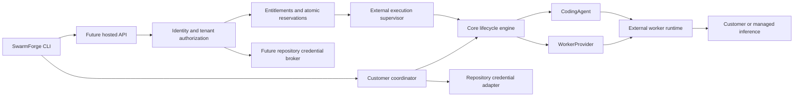

# Execution architecture and extension points

## Decision

Keep the existing single-process local coordinator. Build a small hosted edge API and external execution supervisor later. Share domain/lifecycle behavior through adapters; commercial policy lives at admission and resource boundaries outside the core. A wholesale rewrite, new microservices per capability, or port of Bun/SQLite to Workers is unnecessary for Phase 1.

Arrows describe allowed dependencies, not existing hosted components. Local CLI and Git operate without the right-hand hosted policy path. Cloudflare/Stripe types must not enter domain/coordinator contracts. Hosted APIs may reuse MCP argument naming and result shapes, but must establish identity and ownership before dispatch and cannot expose unrestricted current MCP tools.

## Boundaries

| Layer | Responsibility | Current integration / future work |
| --- | --- | --- |
| CLI | Configuration, onboarding, repository auth, operator UI and selected execution endpoint | `connectSwarmForge(url, token, scrubText)` already separates transport; local default stays unchanged. Future explicit cloud commands use separate credentials and routes. |
| Core | Durable lifecycle, queue/dispatch controls, safe finalization/recovery | `Coordinator(config, store, provider, agent)`; no Stripe/Cloudflare dependency. Still concrete Bun Store and single-owner scheduler. |
| Worker runtime | Execute task, report run results, isolate workspace and use scoped credentials | OpenCode today; no tenant-authorized worker ingress protocol yet. |
| Infrastructure | Create/discover/prepare/pause/resume/destroy/read/exec and artifact transport | Existing `WorkerProvider`; Freestyle production adapter, fake test adapters. No arbitrary customer-provider driver is claimed. |
| Hosted control plane | Accounts, tenants, linking, enrollment, task admission, revocation and subscription projection | Proposed API/D1 metadata layer; execution and heavy artifacts remain external. |
| Commercial authentication/billing | Authenticate cloud accounts; project authoritative subscription state | Future identity adapter and billing webhook adapter; website payment workflow only. |
| Enforcement/accounting | Evaluate capabilities, reserve concurrent/period resources and reconcile usage | Future server authority; local estimates and config caps are not substitutes. |

## Minimal Phase 1 code seam

`WorkerProvider.stopWorkerRuntime?(worker: Worker): Promise<void>` is attached to existing `Coordinator.quiesce`, invoked after best-effort `CodingAgent.abort`. Resolution means the provider verified that no agent work can continue; uncertainty must reject. Freestyle performs the existing stop-and-inactive systemd proof. Older providers without this hook retain the original OpenCode exec command. A rejecting new hook never falls back to an unrelated legacy runtime; existing VM-pause/missing protections continue.

This is a real present control integration, not a speculative cloud class. It lets a future remote provider stop its runtime without executing OpenCode-specific shell in the coordinator. It is only part of the separation: Freestyle preparation remains OpenCode-specific and persisted session naming remains unchanged for compatibility. A future alternative adapter must also satisfy filesystem/artifact and safety semantics, not merely return a VM ID.

## Deliberately documented, not added to production

- **Execution selection:** current configurable MCP transport and server adapter injection suffice. Future CLI cloud transport is added when routes exist; no unused `CloudExecutionProvider` factory.
- **Entitlement provider:** contract in [entitlements](entitlements.md); hosted admission is its future consumer. No “allow all” cloud-ready provider in local core.
- **Identity provider:** future edge adapter returns a verified `CloudPrincipal` (subject, credential ID, audience/scopes/expiry); organization membership and resource ownership come from server records. Current GitHub module remains a repository adapter. No new OAuth wrapper.
- **Usage accounting:** use existing per-message max-upserts and durable events for local observation. Future supervisor accounting ingests stable source/event IDs through a ledger adapter and trusted reservations. It must distinguish observed coverage from pricing coverage and reconcile external supplier records. No unused observer callback or accounting schema.

## Coupling and staged extraction

Freestyle writes OpenCode configuration/systemd; Worker stores `opencode_session_id`; legacy stop fallback is OpenCode-specific. Core depends on broad provider-required `Config`, concrete Store, filesystem/FFI locking, and `security.ts` directly reads GitHub credentials; `safety.ts` imports shell quoting from Freestyle. These do not require cloud connectivity but prevent a drop-in edge deployment. Retain working behavior now; extract runtime preparation, minimal policy-neutral config and credential-screening inputs when a second production adapter actually needs them. Do not rename persisted fields or create a giant persistence repository interface prematurely.

Hosted execution starts with a single durable external supervisor and explicitly scoped assignments. D1 metadata is not the current scheduler database. Tenant-scoped queries, conditional admission/reservations, a durable delivery/outbox protocol and deduplication must be implemented before hosted task creation can have effects. A tenant-local supervisor/store is a possible initial isolation model; sharing one unmodified Store across tenants is unsafe.
