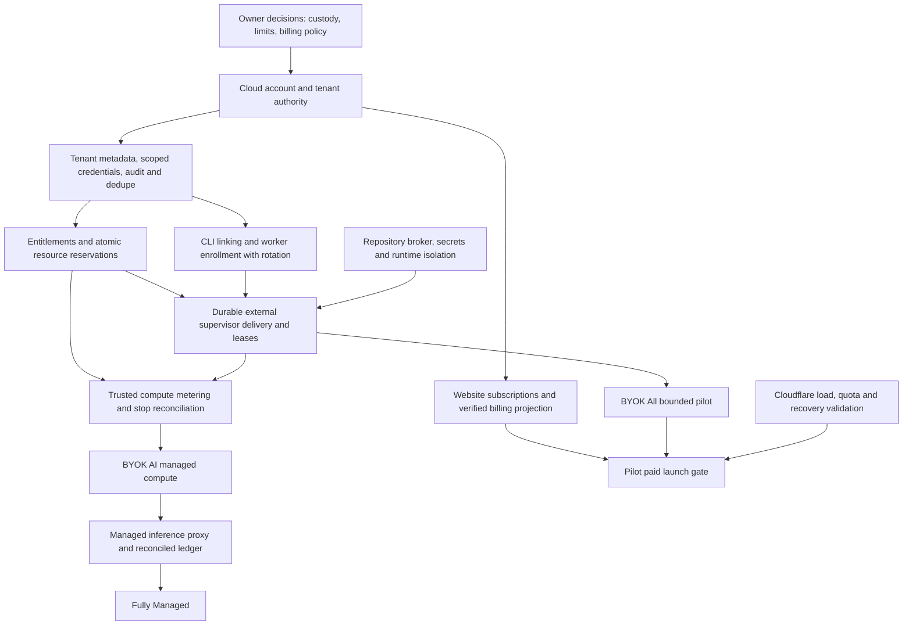

# Phase 1: product architecture and commercial foundation

Date: 2026-10-08. Application baseline `9f2953e`; existing user changes committed separately as `9216ed5`. This phase documents a commercial path while preserving free self-hosting. Proposed hosted APIs/capabilities are not implemented services.

## Deliverables

| Document | Purpose |
| --- | --- |
| [Current state](current-state.md) | Code-supported inventory of CLI, lifecycle, VMs, repository auth/Git, APIs, persistence, infrastructure and tests. |
| [Product tiers](product-tiers.md) | Four editions, capability/ownership matrix and unresolved commercial decisions. |
| [Architecture boundaries](architecture-boundaries.md) | Local/core/runtime/provider/cloud separation, present extension points and remaining coupling. |
| [Identity and trust](identity-and-trust.md) | Repository, cloud-account, CLI, worker, org and subscription authority; compromised-worker constraints. |
| [Entitlements](entitlements.md) | Boolean/count/meter model, provider interface, reservations and server enforcement. |
| [Cloud API contracts](cloud-api-contracts.md) | Versioned routes, auth/authorization, schemas, errors, idempotency and ownership. |
| [Deployment](deployment.md) | Cloudflare Free design/verified limits, external execution, secret handling and reliability. |
| [Implementation plan](implementation-plan.md) | Grounded implementation scope and validation/review requirements. |
| [Validation](validation.md) | Commands, evidence, skips, review scope and residual risks. |

## What already exists

Working Bun CLI/server and stateless MCP transport; injectable Freestyle worker and OpenCode agent adapters; SQLite lifecycle/dispatch/run-result persistence; safe recovery, timeouts and cancellation/destruction; GitHub Device Flow, GitHub App and SSH repository handoff; remote-SHA verification; separate artifact finalization, bounded data transfer and retention; local configuration diagnostics/redaction; token observations, estimated costs and budget alerts; CLI/dashboard controls; binary packaging, CI and draft-release workflow.

“Self-hosted” today means customer-operated control plane with customer-supplied Freestyle and model access. It does not yet provide arbitrary local worker compute. Team/task labels do not establish tenancy. Compare URLs are not opened PRs. Budget alerts are not enforcement; pricing coverage is not complete inference accounting.

## What changed

- Documented actual implementation and four intended tiers, trust boundaries, entitlement model, hosted API contracts, deployment design, gaps and implementation dependencies.
- Added optional `WorkerProvider.stopWorkerRuntime(worker): Promise<void>` at the actual cancellation/quiescence point. Freestyle verifies systemd runtime stop; old injected providers retain the prior exec behavior. A failed hook retains VM pause/missing protections and does not invoke an unrelated runtime fallback.
- Fixed terminal event payload redaction. Structured data is parsed and screened for sensitive fields and known credentials, then final rendered output is screened; file records use the screened payload. Tests cover nested fields, JSON escapes, malformed fallback, terminal/file output and cursor behavior.
- Added behavioral tests for custom runtime stop, uncertain stop with pause, and Freestyle command success/failure proof.

No dependencies or database migrations added. No Stripe, new OAuth flow, hosted endpoint, D1 provisioning, cloud deployment or production infrastructure change. GitHub Device Flow/config/credential flows remain unchanged; the adapter runtime-stop method is independent of repository auth. Existing checkout documentation/skill/reviews were committed at the user's explicit request separately from this phase.

## Decisions and rationale

1. Preserve the working single-process coordinator and injectable adapters. Avoid a large rewrite or unused commercial classes.
2. Keep commercial policy and identity at future hosted admission/resource boundaries. Core has no Stripe/Cloudflare/account-service dependency; local operation requires no hosted entitlement check.
3. Introduce only the concrete runtime-stop hook in production. Identity/entitlement/usage contracts stay in documentation until real hosted consumers exist; existing config/transport/provider interfaces supply current extension points.
4. Treat cloud tenant as server-owned organization authority separate from client team/task labels. All proposed routes qualify resources, references, cursors and accounting by verified tenant ownership.
5. Preserve GitHub Device Flow for CLI repositories. Broad OAuth token binding is local policy, so future hostile cloud workers require a broker/repository-scoped installation credentials rather than this token handoff.
6. Require atomic reservations and reliable external dispatch before hosted task acceptance. Entitlement evaluation alone cannot provision; usage observations cannot authorize or bill resources.
7. Use Cloudflare edge only for small metadata/policy APIs and static hosting. Execution, local SQLite lifecycle, Git processes and large artifacts stay external. Free quotas bound a pilot; heartbeats require explicit capacity budgeting.
8. Retain cleanup access after subscription failure. Failed policy/edge must not strand managed resources; leases and trusted supervisor stop protect cost exposure.

## Prioritized gaps and risks

| Priority | Gap / risk | Existing evidence / next prerequisite |
| --- | --- | --- |
| P0 before any hosted launch | No cloud principal, tenant membership or resource authorization; instance bearer is global | Implement identity/tenant authority and isolation tests before public task/worker routes. |
| P0 before untrusted cloud workers | Broad user GitHub token and shared model key can enter privileged runtime | Broker/scoped repository authority; tenant-bound inference credentials, secret custody, runtime/network isolation and adversarial tests. |
| P0 before paid resource execution | Budget is advisory; accounting misses old bounded history and has no supplier reconciliation | Atomic quotas/reservations, finite leases, trusted compute/inference meter, stop/recovery reconciliation. |
| P0 before public coordinator exposure | Separate metrics listener bypasses API auth | Private/disabled operational bind now; explicit authenticated operational protection in next phase. |
| P1 security hardening | App/SSH arbitrary echoed credentials not demonstrated screened; raw OAuth copies persist in DB | Register/screen all transient secrets and define credential storage/retention/rotation. Do not promise redaction alone prevents exfiltration. |
| P1 hosted reliability | No durable edge-to-supervisor delivery/lease protocol or shared reservation authority | Tenant-qualified D1 metadata/outbox, deduplicated external supervisor protocol, crash/partition tests. |
| P1 extensibility | OpenCode-specific preparation/session fields and legacy stop fallback; concrete Store/config/FFI dependencies | Extract adapter runtime preparation when another runtime is actually introduced; external supervisor stays Bun initially. |
| P1 deployment capacity | Cloudflare Free request/write/CPU quotas and no verified commercial deployment | Load/crypto/quota tests, upgrade thresholds, preview/prod separation, backup/recovery and operational monitoring. |
| P2 product completeness | No direct Device Flow tests, first-class PR/merge API, local-container adapter or dependency scheduler | Add by scoped product requirement; do not advertise them as delivered. |
| P2 release/site operations | Site Pages description diverges from Workers assets configuration; installer/live deployment recorded incomplete | Owner chooses canonical deployment; separate authorized release/site validation. |

P0 means a blocker for the corresponding future launch, not permission to rewrite the existing authentication system now. The confirmed logger leak is fixed here; other risks are disclosed and remain prerequisites.

## Unresolved business decisions

Plan prices, currencies/intervals/taxes, seat/org ownership, trials/support/SLA, worker sizes/quotas, compute/inference units/rates/allowances, overage versus hard caps, grace/downgrade behavior, retained-VM/storage/egress charging, BYOK secret custody, supported providers/models/regions, repository broker/App choice, managed-tier customer-worker support, license exceptions and data retention. See [product tiers](product-tiers.md) for the full decision list. No pricing, legal exception or paid quota is invented by this phase.

## Phase 2 dependency graph

Recommended order:

1. Resolve minimum launch business choices and harden current operational exposure/secret screening; define what cloud can store.
2. Deliver cloud accounts, tenant memberships, audit/revocation authority and tested D1 ownership/deduplication schema in isolated preview infrastructure.
3. Add separate CLI linking plus customer worker enrollment/rotation; preserve existing GitHub and local paths. Test wrong audiences/tenants, replay and revocation.
4. Implement capability projection, atomic concurrent/metered reservations and policy failure behavior; test concurrent admissions and crash-safe releases.
5. Deliver external supervisor outbox/claim/lease/stop protocol and credential/isolation gates. Validate a bounded BYOK All pilot with untrusted-worker tests.
6. Add website billing/verified subscription projection only as a separately authorized phase. Do not accept paid hosted workloads before entitlement and billing authority are tested together.
7. Add managed compute, authoritative compute accounting, retained-resource reconciliation and per-tenant cost caps for BYOK AI.
8. Add managed inference proxy, provider reconciliation, rate-versioned ledger and cost isolation before Fully Managed.

Independent website UI work can proceed after identity contract stability. Paid billing integration does not justify skipping task/worker isolation. Every stage includes cross-tenant, retry, outage, cleanup and credential-output tests plus deployment quota validation.

## Verification and limitations

See [validation](validation.md) for exact final results and review evidence. Baseline: 582 pass / 2 skip / 0 fail. Final suite: **586 pass / 2 skip / 0 fail**, 3,671 assertions. TypeScript/Biome and binary build/package/verification passed; direct live GitHub authorization, production deployment, payment, managed infrastructure and new hosted API execution remain outside scope. Proposed server enforcement is a contract to implement and test in Phase 2, not an assertion of existing cloud isolation.
